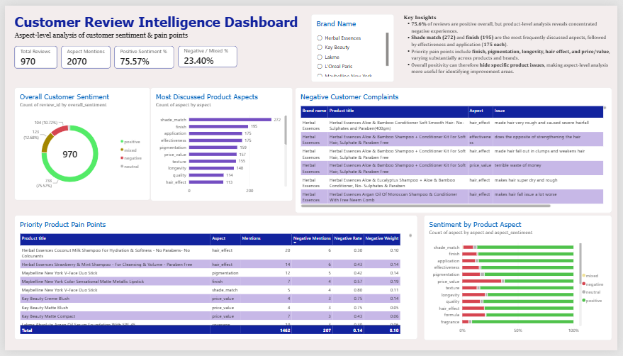

# Customer Review Intelligence

## Overview

Customer reviews contain valuable product feedback, but most of that information is buried inside unstructured text.

This project builds an **AI-assisted customer review intelligence pipeline** that transforms free-text cosmetics and beauty product reviews into structured customer sentiment, product aspects, and complaint themes that can be analysed using SQL and presented through an interactive Power BI dashboard.

The goal is not simply to classify reviews as positive or negative. The project focuses on answering business questions such as:

- What is the overall customer sentiment?
- Which product aspects are repeatedly discussed or criticised?
- Which products contain concentrated customer pain points?
- Which issues have both a high negative rate and meaningful weight within a product's feedback?
- Which pain points recur within individual brands?
- Does listed discount level appear to be associated with customer perception of price/value?

---

## Dashboard



The Power BI dashboard provides an interactive view of:

- overall customer sentiment
- most frequently discussed product aspects
- aspect-level sentiment
- priority product pain points
- underlying negative customer complaints
- brand-level filtering

---

## Business Problem

Star ratings tell a company whether a customer liked a product, but they do not explain **why**.

For example, two customers may both leave a 3-star review for completely different reasons:

- one may like the pigmentation but dislike the longevity
- another may like the formula but consider the product too expensive

Analysing only ratings or overall sentiment hides these distinctions.

This project therefore converts unstructured customer feedback into:

- **overall sentiment** — `positive`, `neutral`, `negative`, or `mixed`
- **product aspects** — such as `shade_match`, `pigmentation`, `longevity`, `price_value`, `texture`, and `finish`
- **aspect-level sentiment** — `positive`, `neutral`, or `negative`
- **specific customer issues** — concise descriptions of negative feedback

This transforms qualitative feedback into measurable relational data that can be queried to identify recurring product strengths and customer pain points.

---

## Dataset

The source dataset is a public Nykaa cosmetics and beauty-product review dataset containing more than **61,000 reviews** across several beauty and personal-care brands.

Important source fields include:

- `review_id`
- `product_id`
- `brand_name`
- `product_title`
- `review_title`
- `review_text`
- `review_date`
- `review_rating`
- `is_a_buyer`
- `pro_user`
- `mrp`
- `price`
- `product_rating`
- `product_rating_count`

The raw source dataset is preserved unchanged at:

`data/nyka_top_brands_cosmetics_product_reviews.csv`

---

# Project Workflow

## 1. Data Cleaning

The raw dataset was inspected and cleaned using Python and Pandas in `src/cleaning.py`.

Cleaning included:

- removing rows with empty or whitespace-only review text
- stripping HTML while preserving customer wording, spelling, slang, punctuation, and meaning
- validating review ratings on the 1–5 scale
- parsing review dates
- auditing price and MRP anomalies without silently deleting them
- preserving missing optional fields such as `review_title` and `author` rather than filling them arbitrarily

The cleaned dataset contains approximately **61,000 usable reviews** and is stored at:

`data/processed/nykaa_cleaned.csv`

---

## 2. Representative Sampling

Processing every review through an LLM was unnecessary for a portfolio-scale analytical demonstration and would increase API usage substantially.

A **1,500-review stratified sample** was therefore generated using `src/sample_reviews.py`.

Sampling was stratified across:

- `brand_name`
- `review_rating`

with a fixed random seed of `42`.

The sampled dataset is stored at:

`data/processed/sampled_reviews_1500.csv`

The final LLM analysis contains **970 successfully processed reviews** because API quota limits interrupted extraction before all 1,500 reviews were completed.

No synthetic or rule-based records were added to fill the remaining gap.

---

## 3. LLM Review Intelligence Extraction

The sampled reviews were processed through an LLM extraction pipeline implemented in:

`src/simple_llm_extraction.py`

The pipeline uses Google's Gemini API through the `google.genai` SDK with structured Pydantic output.

The LLM acts specifically as a **semantic extraction layer**.

Deterministic operations such as cleaning, sampling, storage, validation, aggregation, and analysis remain in Python and SQL.

---

# How the LLM Pipeline Works

## Architecture

```text
Raw Review Dataset
        ↓
Python / Pandas Cleaning
        ↓
Stratified Review Sampling
        ↓
LLM Extraction Prompt
        ↓
Gemini API
        ↓
Pydantic Structured Output Validation
        ↓
Review-Level + Aspect-Level Records
        ↓
CSV Checkpoints
        ↓
SQLite Relational Database
        ↓
SQL Business Analysis
        ↓
Power BI Dashboard
```

### Technology Responsibilities

**Python & Pandas**

Handles deterministic cleaning, sampling, batching, API orchestration, checkpointing, and data preparation.

**Gemini LLM**

Interprets unstructured customer language and extracts structured sentiment, product aspects, and complaint information.

**Pydantic**

Enforces a predictable structured response schema before extracted data enters the analytical pipeline.

**SQLite / SQL**

Stores the relational analytical model and performs aggregation, ranking, validation, and business analysis.

**Power BI**

Presents the resulting customer intelligence through an interactive dashboard.

---

# LLM Input and Output

For each review, the pipeline supplies the review text together with extraction instructions defining sentiment and aspect behaviour.

The expected structured output follows this conceptual schema:

```json
{
  "overall_sentiment": "positive | neutral | negative | mixed",
  "aspects": [
    {
      "aspect": "standardized_aspect_name",
      "aspect_sentiment": "positive | neutral | negative",
      "issue": "specific complaint or null"
    }
  ]
}
```

Examples of standardized aspects include:

- `shade_match`
- `pigmentation`
- `coverage`
- `texture`
- `application`
- `longevity`
- `packaging`
- `fragrance`
- `finish`
- `price_value`
- `quantity`
- `effectiveness`
- `hair_effect`
- `skin_feel`
- `scalp_effect`
- `formula`
- `quality`

### Important Extraction Rules

The extraction prompt requires the model to:

- extract only aspects explicitly supported by the review
- avoid inventing product attributes
- distinguish overall review sentiment from aspect-level sentiment
- classify reviews containing meaningful positive and negative feedback as `mixed`
- correctly interpret negation such as `"not good"` or `"no hairfall"`
- distinguish product claims such as `"Anti Hair Fall Shampoo"` from evidence that a product actually caused hair fall
- normalize similar vocabulary into consistent analytical aspect labels
- capture concise issue descriptions when negative feedback is present

### Source ID Provenance

`review_id` comes directly from the original dataset.

It is **not generated by the LLM**.

This allows every extracted aspect to remain traceable to its original customer review.

### Multiple Aspects Per Review

A single review can discuss multiple product characteristics.

For example:

> "The shade matches perfectly, but it fades quickly and feels drying."

may produce:

```text
overall_sentiment = mixed

shade_match → positive
longevity   → negative
texture     → negative
```

A vague review such as `"Good product"` may legitimately produce no specific aspect rows.

---

# Structured Output with Pydantic

Instead of accepting unrestricted natural-language responses, the pipeline uses predefined Pydantic models for the extraction response.

This provides:

- predictable field names
- schema validation
- structured JSON output
- easier transformation into Pandas DataFrames
- reliable persistence into CSV and SQLite
- cleaner downstream SQL analysis

---

# Analytical Data Model

The final analytical database uses a **one-to-many relational structure**.

## `reviews`

One row represents one analysed customer review.

Important fields include:

| Field | Description |
|---|---|
| `review_id` | Unique source review identifier |
| `product_id` | Product identifier |
| `brand_name` | Brand |
| `product_title` | Product name |
| `review_text` | Cleaned review text |
| `review_rating` | Original star rating |
| `mrp` | Maximum Retail Price |
| `price` | Listed product price |
| `overall_sentiment` | LLM-extracted review sentiment |
| `extraction_method` | Extraction provenance |

## `review_aspects`

One row represents one aspect mentioned within a review.

| Field | Description |
|---|---|
| `review_id` | Links the aspect to its source review |
| `aspect` | Standardized product aspect |
| `aspect_sentiment` | Sentiment toward that specific aspect |
| `issue` | Specific negative issue, when present |

Conceptually:

```text
reviews
review_id | product        | overall_sentiment
----------|----------------|------------------
R001      | Product A      | mixed

review_aspects
review_id | aspect         | aspect_sentiment | issue
----------|----------------|------------------|------------------
R001      | shade_match    | positive         | NULL
R001      | pigmentation   | negative         | weak pigmentation
R001      | longevity      | negative         | fades quickly
```

This structure is important because one review can contain different opinions about different product characteristics.

Keeping review-level and aspect-level information separate allows clean SQL aggregation without forcing multiple aspects into a single row.

---

# Reliability and Validation

## Silent Fallback Incident

During an earlier development run, API failures were caught by overly broad exception handling and silently redirected to a deterministic rule-based fallback.

Validation revealed that these records had **not actually been generated by the LLM**.

That run was discarded.

The incident led to several reliability safeguards being added to the pipeline.

### Safeguards

**1. Fail-fast error handling**

Authentication, provider configuration, billing, quota, and other unrecoverable API failures halt processing instead of silently generating replacement outputs.

**2. Extraction provenance**

Every review records its `extraction_method`, allowing LLM and fallback outputs to be distinguished explicitly.

**3. Checkpoint and resume**

Completed extractions are periodically stored so interrupted runs can resume without unnecessarily reprocessing completed reviews.

**4. Pre-analysis validation**

Before SQL analysis, the final dataset is checked for duplicate review IDs, relational integrity, extraction provenance, and other structural issues.

---

# Final Validation

The final analytical dataset contains:

- **970 review-level records**
- **970 unique review IDs**
- **2,070 aspect-level records**
- **0 duplicate review IDs**
- **0 orphan aspect records**
- **0 foreign-key violations**
- **970/970 reviews extracted using the LLM**
- **905 reviews (93.3%) with at least one extracted aspect**
- **65 reviews (6.7%) with no specific extracted aspect**

A random manual audit of **30 reviews** produced **30/30 passes** for the reviewed sentiment and aspect extraction criteria.

### Rating Alignment Check

Extracted sentiment also showed strong directional alignment with original star ratings:

| Rating | Dominant Extracted Sentiment | Share |
|---|---|---:|
| 1★ | Negative | 94.55% |
| 2★ | Negative | 85.19% |
| 3★ | Mixed | 45.16% |
| 4★ | Positive | 67.42% |
| 5★ | Positive | 92.90% |

The strong alignment between star ratings and extracted sentiment provides a useful validation signal for the LLM-based sentiment extraction.

---

# SQL Analysis

SQL analysis is contained in:

`sql/my_analysis.sql`

The analysis addresses questions including:

1. What is the overall customer sentiment?
2. Which aspects are most frequently discussed?
3. Which aspects receive the highest proportion of negative feedback?
4. Which product pain points combine high negativity with meaningful feedback weight?
5. Which pain points recur within individual brands?
6. How does extracted sentiment align with customer star ratings?
7. Is listed discount level associated with `price_value` sentiment?
8. Which products have high percentages of negative or mixed reviews?
9. What specific complaint text explains recurring negative aspects?

Two metrics are particularly important for prioritising product issues:

### Negative Rate

The proportion of mentions of an aspect that are negative.

```text
Negative Rate =
Negative mentions of an aspect
÷
All mentions of that aspect
```

### Negative Weight

The proportion of all aspect feedback for a product represented by a particular negative aspect.

```text
Negative Weight =
Negative mentions of an aspect
÷
All aspect mentions for the product
```

Using both metrics prevents a very high negative percentage based on only a few mentions from automatically being treated as the most important product problem.

---

# Key Findings

- **75.57% of analysed reviews were positive**, but aggregate sentiment concealed important product-specific dissatisfaction.

- **Shade match (272 mentions)** and **finish (195)** were the most frequently discussed aspects, followed by **effectiveness (175)** and **application (175)**.

- Product-level analysis identified concentrated pain points involving **finish, pigmentation, shade match, longevity, hair effect, and price/value**.

- Combining **negative rate** with **negative weight** helped distinguish high-percentage complaints based on limited feedback from issues carrying greater importance within a product's overall aspect feedback.

- Listed discount level showed **no clear monotonic relationship** with price/value sentiment in the analysed sample.

For the complete product-level, brand-level, and discount analysis, see **[Findings.md](Findings.md)**.

---

# Business Recommendations

Based on the analysis:

1. Prioritise product issues using both **negative rate** and **negative weight** rather than raw complaint counts alone.

2. Investigate recurring product-level issues involving:
   - finish
   - pigmentation
   - shade match
   - longevity
   - hair effect
   - price/value

3. Review the extracted `issue` text before recommending a product change to understand what customers are actually describing.

4. Avoid comparing brands using raw complaint counts because representation differs across brands in the final sample.

5. Treat extreme percentages based on very small numbers of mentions as investigation signals rather than definitive conclusions.

6. Do not assume that larger discounts automatically improve customer perception of value.

---

# Discount vs Price/Value

The analysis tested whether larger listed discounts were associated with more positive `price_value` sentiment.

No clear monotonic relationship was observed.

Price/value perception may reflect factors beyond discount level, such as product performance, quantity, quality, effectiveness, longevity, and overall product experience.

These factors were not individually tested as causes of price/value sentiment in this analysis.

Therefore, the analysis supports only the conclusion that **listed discount level alone does not show a clear relationship with price/value sentiment**.

The analysis identifies association only and does not establish causation.

---

# Future Recommendation

Beauty platforms can potentially improve the quality of customer feedback by collecting structured product-specific attributes alongside free-text reviews.

Examples could include:

- shade match
- pigmentation
- finish
- longevity
- texture
- application
- fragrance
- skin feel
- hair effect
- price/value

Structured attributes would provide cleaner first-party analytical data, while free-text reviews could continue capturing customer experiences that fall outside predefined categories.

---

# Limitations

- The source dataset is historical.
- The final analysis contains **970 LLM-processed reviews**, rather than the complete source dataset.
- API quota interruption means the final 970-review sample is not perfectly balanced across brands.
- Brand-level analysis therefore focuses on within-brand rates rather than raw complaint counts.
- Some product-level findings are based on relatively small numbers of reviews or aspect mentions.
- LLM outputs remain model-generated interpretations despite programmatic validation and manual auditing.
- `price` represents the listed product price in the dataset and is not necessarily the amount paid by an individual reviewer.
- The dataset does not contain actual sales or order data.
- The project therefore does not make claims about causal drivers of sales or best-selling products.

---

# Tech Stack

- **Python**
- **Pandas**
- **Gemini API**
- **Pydantic**
- **SQLite**
- **SQL**
- **Power BI**

---

# Project Structure

```text
customer-review-intelligence/
├── README.md
├── Findings.md
├── requirements.txt
├── run_portfolio_pipeline.py
├── EDA.ipynb
│
├── data/
│   └── processed/
│       ├── reviews_summary.csv
│       └── review_aspects.csv
│
├── sql/
│   ├── schema_and_validation.sql
│   └── my_analysis.sql
│
├── src/
│   ├── __init__.py
│   ├── cleaning.py
│   ├── sample_reviews.py
│   └── simple_llm_extraction.py
│
├── tests/
│   ├── __init__.py
│   └── test_cleaning.py
│
└── assets/
    └── customer_review_dashboard.png
```

---

# Final Takeaway

The project demonstrates how unstructured customer feedback can be transformed into structured product intelligence.

Although **75.57% of the analysed reviews were positive overall**, aspect-level analysis revealed concentrated product-specific pain points that would be difficult to identify from star ratings or aggregate sentiment alone.

By combining LLM-based semantic extraction with relational SQL analysis and Power BI visualization, the project moves customer reviews from unstructured text toward measurable and interpretable product feedback.